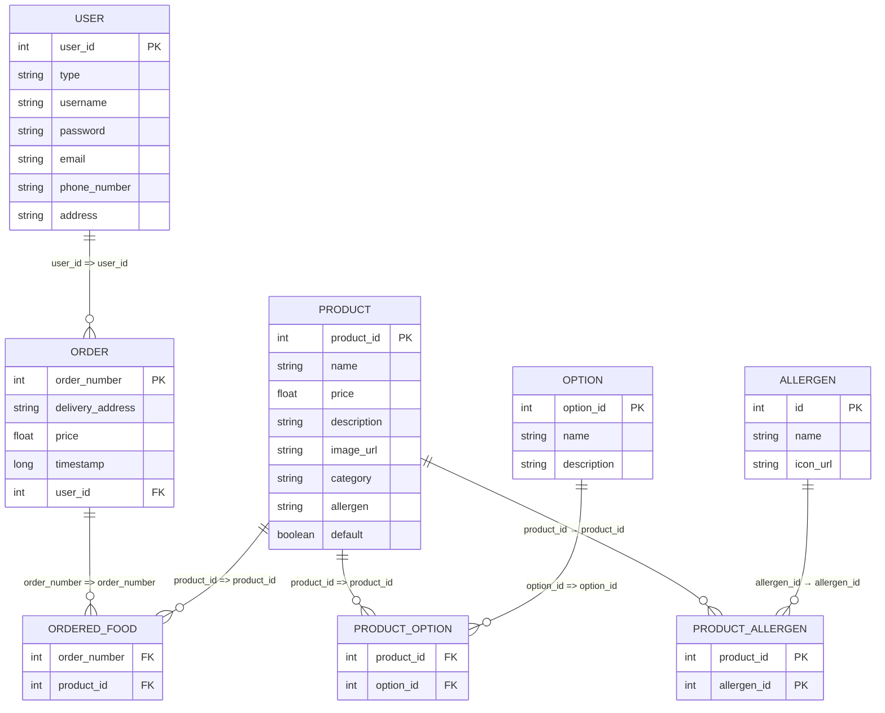

# Restaurant Webapp

## Database schema

```mermaid
erDiagram
    USER {
        int user_id PK
        string type
        string username
        string password
        string email
        string phone_number
        string address
    }

    ORDER {
        int order_number PK
        string delivery_address
        float price
        long timestamp
        int user_id FK
    }

    ORDERED_FOOD {
        int order_number FK
        int product_id FK
    }

    PRODUCT {
        int product_id PK
        string name
        float price
        string description
        string image_url
        string category
        string allergen
        boolean default
    }

    PRODUCT_OPTION {
        int product_id FK
        int option_id FK
    }

    OPTION {
        int option_id PK
        string name
        string description
    }

    ALLERGEN {
        int id PK
        string name
        string icon_url
    }

    PRODUCT_ALLERGEN {
        int product_id PK
        int allergen_id PK
    }

    USER ||--o{ ORDER : "user_id => user_id"
    ORDER ||--o{ ORDERED_FOOD : "order_number => order_number"
    PRODUCT ||--o{ ORDERED_FOOD : "product_id => product_id"
    PRODUCT ||--o{ PRODUCT_OPTION : "product_id => product_id"
    OPTION ||--o{ PRODUCT_OPTION : "option_id => option_id"
    PRODUCT ||--o{ PRODUCT_ALLERGEN : "product_id → product_id"
    ALLERGEN ||--o{ PRODUCT_ALLERGEN : "allergen_id → allergen_id"
```
