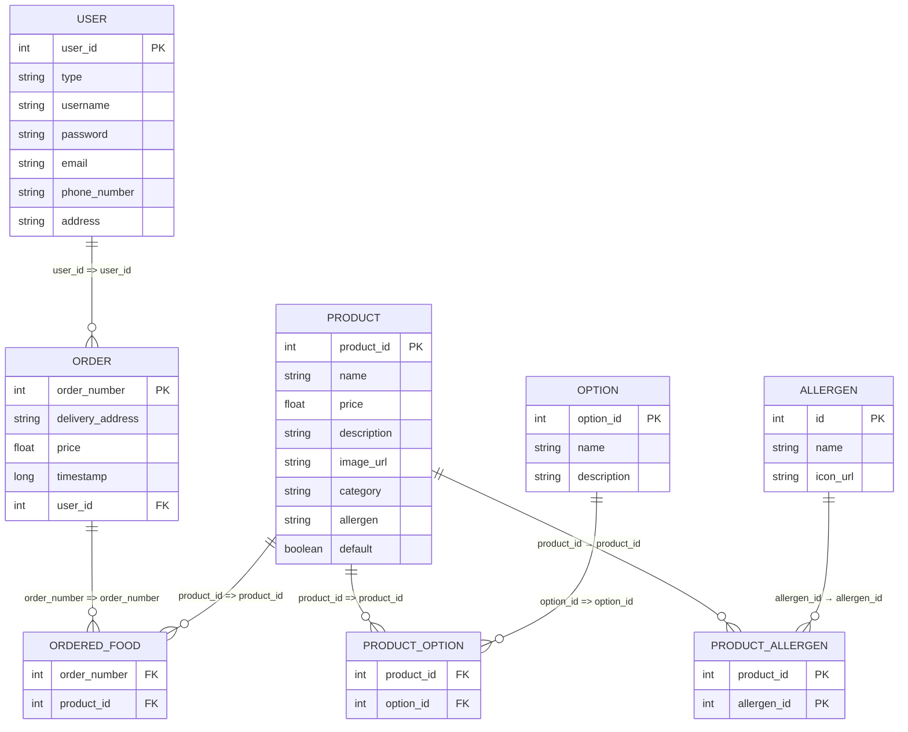

# Restaurant Webapp

## Idea and target audience

The application is an open source full stack takeout food order management system. Due to the open source nature users 
can modify the application for their own needs.

The application is made for starting restaurants who want to offer takeout option for their customers without paying
the fees of third party platforms such as Wolt or Foodora. 

## Features

### User

Users can login and register an account. 

Users can change options on products before adding them to order. Users can make orders.

Users can add products to cart and return later to complete the order.

Users can see their own order history.

### Admin

Admins can create, delete and modify products.

Admins can manage orders.

Admins can view made orders.

## Database schema

## UI Wireframe mockup

## Deployment

API is deployed in https://test.onesnzeroes.dev **NOW AVAILABLE IN METROPOLIA NETWORK**

Instructions for deployment below

Source [`init-db.sql`](https://github.com/leevilaune/WebProject/blob/main/sql-scripts/init-db.sql)

Run `npm install`

Run `npm run start`

Optional:

Source [`insert-mock-data.sql`](https://github.com/leevilaune/WebProject/blob/main/sql-scripts/insert-mock-data.sql)

For mock data
